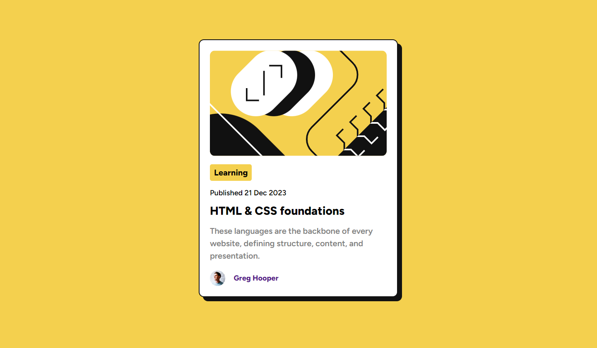

# Frontend Mentor - Blog preview card solution

This is a solution to the [Blog preview card challenge on Frontend Mentor](https://www.frontendmentor.io/challenges/blog-preview-card-ckPaj01IcS). Frontend Mentor challenges help you improve your coding skills by building realistic projects.

## Table of contents

- [Overview](#overview)
  - [The challenge](#the-challenge)
  - [Screenshot](#screenshot)
  - [Links](#links)
- [My process](#my-process)
  - [Built with](#built-with)
  - [What I learned](#what-i-learned)

## Overview

### The challenge

Create a blog preview card.

Users should be able to:

- See hover and focus states for all interactive elements on the page (title of the article)

### Screenshot



### Links

- [Solution URL:](https://github.com/crolette/blog-preview-card-main)
- [Live Site URL:](https://crolette.github.io/blog-preview-card-main/)

## My process

### Built with

- Semantic HTML5 markup
- CSS custom properties and nesting
- upload to Git directly via GitHub in VS Code

### What I learned

Improve my CSS nesting knowledge

```css
.card {
  display: flex;
  flex-direction: column;
  row-gap: 16px;
  width: 385px;
  background-color: var(--white);
  padding: 20px;
  border: 2px solid var(--black);
  border-radius: 10px;
  box-shadow: 8px 8px var(--black);

  img.card__illustration {
    border-radius: 10px;
  }
```
